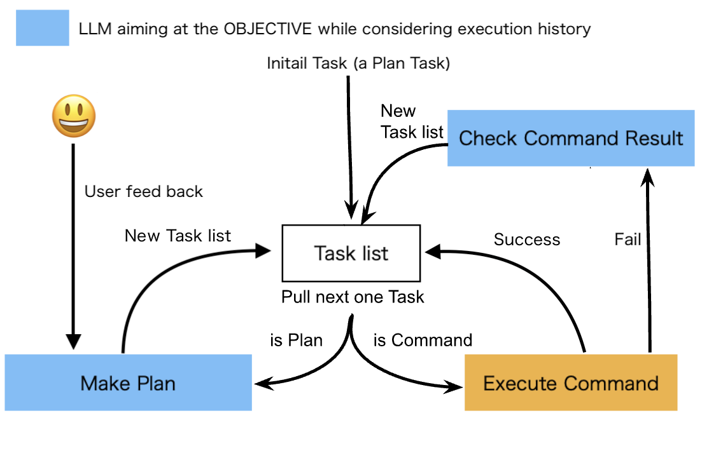

# ⭐️Claude 3.5 Sonnet(8Kアウトプット)とGPT-4oに対応⭐️

# 注意事項

- 意図せず環境を破壊する恐れがあります。基本的にはDockerなどの仮想環境で実行してください。
- 目的を達成できず、ループし続けることがあります。その際にAPIの使用量が多くなることがありますので、責任を持って使用してください
- 基本的にはClaude 3.5 Sonnet以上で検証しているため、Claude 3.5 Sonnet以上の使用を推奨します(BabyCommandAGIではClaude 3.5 Sonnetを使用すると[こちら](https://x.com/alexalbert__/status/1812921642143900036) の8Kアウトプットが使用されます)
(GPT-4 Turboを利用する場合は旧バージョンのBabyCommandAGIのv3を使用することを推奨します)

# 目的

BabyCommandAGIはGUIよりも古くからあるコンピューターとの対話インタフェースであるCLIとLLMを組み合わせた時、何が起きるのか検証するためのものです。コンピューターに詳しくない方はご存知無いかもしれませんが、CLIは古くからあるコンピューターとの対話インターフェースです。現在もCLIを通すことで多くのコンピューターの操作ができます(よくあるLinuxサーバーはCLIを主に使用します)。LLMとCLIが会話するのを想像してみてください。何が起きるかワクワクしますよね。是非皆さんも触って新しいユースケースを見つけて頂けると幸いです。

このシステムを動かすにはClaude 3.5 Sonnet以上のAPIを推奨します。

このPythonスクリプトのシステムは[BabyAGI](https://github.com/yoheinakajima/babyagi)をベースにしています。但し、[BabyAGI](https://github.com/yoheinakajima/babyagi)の思考部分だった箇所について効率良くコマンドが実行するためにかなり簡略化してしまっています。(後に変えていくかもしれません)

# ユースケース

BabyCommandAGIは様々なケースで使用できる可能性があります。是非皆さん使ってユースケースを見つけてみてください。

下記にわかっている有用なユースケースが記載しておきます。

## 自動プログラミング

フィードバックするだけでアプリを自動的に作らせる

### プログラミング例

- リバーシ
https://x.com/saten_work/status/1791550524988490053
- スネークゲーム
https://x.com/saten_work/status/1723509089471492563

## 自動環境構築

- コンテナのLinux環境にFlutterをインストールし、Flutterアプリを作成して、Webサーバーを立ち上げ、コンテナ外からアクセスできるようにさせる

https://twitter.com/saten_work/status/1667126272072491009

## その他

- 天気予報の取得
https://x.com/saten_work/status/1791558481432232355

# 仕組み

このスクリプトは、次のような継続したループを実行することで動作します

1. タスクリストから次のタスクを取り出す。(最初は1つの計画タスクから始まる)
2. そのタスクがコマンドタスクか計画タスクかを判別する
3. コマンドタスクの場合:
    1. コマンドを実行
    2. コマンド実行結果のStatus Codeが0(成功)の場合:
        5.へ
    3. それ以外(失敗):
        実行履歴をLLMで分析し、目的に応じて新しいタスクリストを作成
4. 計画タスクの場合:
    1. 計画内容と実行履歴と目的を元にLLMで計画し、新しいタスクリストを作成する
5. ユーザーのフィードバックが生じている場合:
    1. フィードバックを意識しつつ目的と実行履歴を元にLLMで計画し、新しいタスクリストを作成する




# セットアップ

以下の手順を実施してください。

1. ```git clone https://github.com/saten-private/BabyCommandAGI.git```
2. ```cd```でBabyCommandAGIのディレクトリに入ってくださ
3. ```cp .env.example .env``` で環境変数を入れるファイルを作ります
4. ANTHROPIC_API_KEYを設定します。(OpenAIのモデルを使用する場合はOPENAI_API_KEYを設定します)
5. （オプション）OBJECTIVE変数にタスク管理システムの目的を設定します。

# 実行(Docker)

前提条件として、docker と docker-compose がインストールされている必要があります。Docker desktop は最もシンプルなオプションです https://www.docker.com/products/docker-desktop/

## 実行

```
docker-compose up -d && docker attach babyagi
```

## 停止

```
docker-compose stop
```

**注意：Ctrl+Cで終了しても```docker-compose stop```や```./clean.sh```を実行しない限り停止しません。ご注意ください。**

**注意：目的を達成できず、ループし続けることがあります。AnthropicやOpenAIのAPIの使用料にご注意ください。**

```workspace```フォルダにAIの生成物が作成されていきます。

失敗した場合は、再度実行すれば途中から再開できます。

OBJECTIVEを変更すると将来のタスク一覧とOBJECTIVEのフィードバックがクリアされます。

## AIにフィードバック

"f"を入力した際に目的に対してユーザーのフィードバックをAIに与えられます。これでGUIのようなCLIからわからない情報もAIにフィードバックできます。

## AIのコマンド実行中に返答

通常時はAIが実行しているコマンドに対して"y"や"n"のような返答はできませんが、"a"を入力すると返答できるモードになります。

(ちなみにシェルコマンドが"y"や"n"のような返答を待ったまま5分以上経過し、LLMが返答した方が適切と考えた場合、その時の状況を判断して自動的にLLMが"y"や"n"のような返答を行います。)

# 便利コマンド

- ```./clean.sh```

```workspace```、環境(コンテナ)をリセットします。また```./new_store.sh```も実行します
- ```./backup_workspace.sh```

```workspace_backup```に現在時刻のフォルダを作成して```workspace```をバックアップします
(環境(コンテナ)やBabyCommandAGIのデータはバックアップされないのでご注意ください)
- ```./new_store.sh```

BabyCommandAGIのデータ(覚えている情報)を新しくします。新しいデータに切り替わるため、BabyCommandAGIは何も覚えていない状態になります。

# ログ

実行時のログが```log```フォルダ配下に残るようになっています。
OBJECTIVEの識別子とRESULTS_STORE_NAMEによりログファイル名は決まります。

# 保存データ

以下にそれぞれ途中まで実行された状態が保存されます。
- ```data```フォルダ配下に途中まで実行されたタスクは保存されています。
- ```pwd```フォルダ配下には最後のカレントディレクトリ
- ```env_dump```フォルダ配下には最後の環境変数のdump

# コントリビュート

BabyCommandAGI はまだ初期段階にあり、その方向性とそこに到達するためのステップを決定しているところです。現在、BabyCommandAGI が目指しているのは、「シンプル」であることです。このシンプルさを維持するために、PR を提出する際には、以下のガイドラインを遵守していただくようお願いいたします:

- 大規模なリファクタリングではなく、小規模でモジュール化された修正に重点を置く。
- 新機能を導入する際には、対応する特定のユースケースについて詳細な説明を行うこと。

@saten-private (2023年5月21日)からのメモ:

私はオープンソースへの貢献に慣れていません。昼間は他の仕事をしており、PRやissueのチェックも頻繁にできるかはわかりません。但し、このアイディアを大事にしており、みんなの役に立つと良いと考えています。何かあれば気軽におっしゃってください。皆さんから多くのことを学びたいと思っています。
私は未熟者であり、英語も話せませんし、日本以外の文化をほぼ知らないです。但し、自分のアイディアを大事にしているし、多くの人の役に立つと良いとも考えています。
(きっとこれからもつまらないアイディアをいっぱい出すと思います)

<h1 align="center">
  ✨ BabyCommandAGIのGitHub Sponsors ✨
</h1>

<p align="center">
 このプロジェクトの維持は、すべての下記スポンサーのおかげで可能になっています。このプロジェクトのスポンサーとなり、あなたのアバターのロゴを下に表示したい場合は、<a href="https://github.com/sponsors/saten-private">ここ</a> をクリックしてください。💖 5$でスポンサーになることができます。
</p>

<p align="center">
<!-- sponsors --><a href="https://github.com/azuss-p"></a><!-- sponsors -->
</p>

