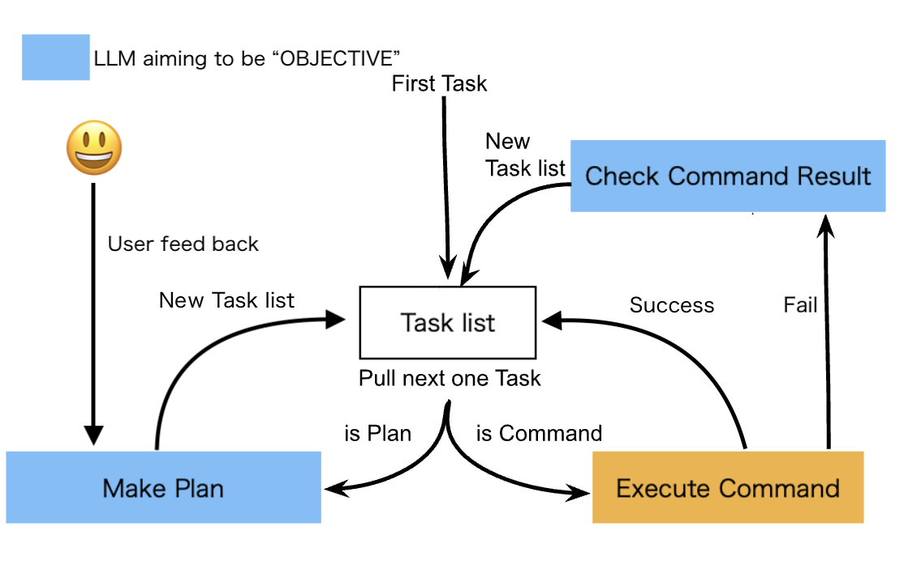

# Precautions

- There is a risk of inadvertently damaging the environment. Please execute primarily in a virtual environment such as Docker.
- The objective may not be achieved and it may continue to loop. The amount of API usage may increase in such cases, so please use responsibly.
- It is recommended to use GPT-4 or higher as it has been mainly verified with GPT-4 or higher.

# Objective

BabyCommandAGI is designed to test what happens when you combine CLI and LLM, which are older computer interaction interfaces than GUI. Those who are not familiar with computers may not know, but CLI is an old computer interaction interface. Even now, many computer operations can be done through CLI (common Linux servers mainly use CLI). Imagine LLM and CLI having a conversation. It's exciting to think about what could happen. I hope you will all try it out and find new use cases.

This system is recommended to be run with an API of GPT-4 or higher.

This Python script system is based on [BabyAGI](https://github.com/yoheinakajima/babyagi). However, the part that was the thinking part of [BabyAGI](https://github.com/yoheinakajima/babyagi) has been greatly simplified in order to execute commands efficiently. (This may change later)

# Use Cases

BabyCommandAGI has the potential to be used in various cases. Please try using it to find use cases.

Below are some known useful use cases.

## Automatic Programming

- Create an app automatically just by providing feedback

https://twitter.com/saten_work/status/1674855573412810753

## Automatic Environment Setup

- Install Flutter in a Linux container environment, create a Flutter app, launch a web server, and make it accessible from outside the container

https://twitter.com/saten_work/status/1667126272072491009

# Mechanism

This script works by executing the following continuous loop:

1. Retrieve the first task from the task list.
2. Determine if that task is a command task or a planning task.
3. If it's a command task:
    1. Execute the command.
    2. If the command execution result has a Status Code of 0 and no response:
        Proceed to the next task.
    3. Otherwise:
        Analyze the result of the command execution with LLM, check if the objective is complete, and if not, create a new task list.
4. If it's a planning task:
    1. Execute the plan with LLM.
    2. Analyze the executed plan with LLM and create a new task list.



# Setup

Please follow the steps below:

1. ```git clone https://github.com/saten-private/BabyCommandAGI.git```
2. Enter the BabyCommandAGI directory with ```cd```.
3. Create a file to insert environment variables with ```cp .env.example .env```.
4. Set the OpenAI key to OPENAI_API_KEY.
5. Set the name of the table where the task results are saved to the TABLE_NAME variable.
6. (Optional) Set the objective of the task management system to the OBJECTIVE variable.
7. (Optional) Set the system's first task to the INITIAL_TASK variable.

# Execution (Docker)

As a prerequisite, docker and docker-compose must be installed. Docker desktop is the simplest option https://www.docker.com/products/docker-desktop/

Please execute the following:

```
docker-compose up -d && docker attach babyagi
```

**Note: Even if you exit with Ctrl+C, it will not stop unless you stop the container with Docker Desktop or similar. Please be careful.**

**Note: The agent might loop indefinitely if it cannot achieve its objective. Please be aware of the cost of OpenAI API usage.**

The AI's generated items will be created in the ```workspace``` folder.

If you fail, you can resume from where you left off by running it again.

Changing the OBJECTIVE will clear the list of future tasks and OBJECTIVE feedback.

The following are saved up to the point where they were executed:
- Tasks executed up to a certain point are saved under the ```data``` folder.
- The last current directory is under the ```pwd``` folder.
- The dump of the last environment variables is under the ```env_dump``` folder.

If you want to reset the environment, please delete the Docker container of BabyCommandAGI once and change the RESULTS_STORE_NAME in ```.env```.
(BabyCommandAGI executes various commands, so the environment may be broken)

## Feedback to AI

By entering "f", you can give user feedback to the AI. This allows you to provide feedback to the AI on information that may not be clear from the CLI, like a GUI.

# Logs

The logs during execution are saved under the ```log``` folder.
The log file name is determined by the OBJECTIVE identifier and the RESULTS_STORE_NAME.

# Contributing

BabyCommandAGI is still in the early stages, determining its direction and the steps to get there. Currently, BabyCommandAGI is aiming for simplicity. To maintain this simplicity, when submitting PRs, we kindly ask you to follow the guidelines below:

- Focus on small, modularized fixes rather than large-scale refactoring.
- When introducing new features, provide a detailed explanation of the corresponding specific use cases.

Note from @saten-private (May 21, 2023):

I am not used to contributing to open source. I work another job during the day and I don't know if I can check PRs and issues frequently. However, I cherish this idea and hope it will be useful for everyone. Please feel free to let me know if there's anything. I am looking forward to learning a lot from you all.
I am a novice, I cannot speak English, and I barely know cultures outside of Japan. However, I cherish my ideas, and I hope they will be of use to many people.
(I'm sure I will continue to come up with many boring ideas in the future)

<h1 align="center">
  ✨ BabyCommandAGI's GitHub Sponsors ✨
</h1>
<p align="center">
  The maintenance of this project is made possible thanks to all of the following sponsors. If you'd like to become a sponsor and have your avatar logo displayed below, please <a href="https://github.com/sponsors/saten-private">click here</a>. 💖 You can become a sponsor for $5.
</p>
<p align="center">
<!-- sponsors --><a href="https://github.com/azuss-p"></a><!-- sponsors -->
</p>